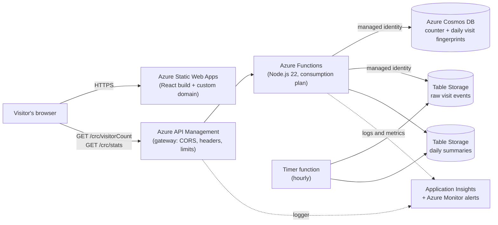

# Cloud Resume on Azure

[](https://github.com/a-josuke/cloud-resume-azure/actions/workflows/deploy-test.yml)

My resume website, built and run on **Microsoft Azure** as my take on [The Cloud Resume Challenge](https://cloudresumechallenge.dev/) (Azure Edition). The site is a **React** single-page app built with Vite. The interesting part is everything behind it: an API behind an API gateway, a database, an analytics pipeline, infrastructure written as code, automated builds and deployments, monitoring and security hardening.

**Live site:** https://cloud.ankit-dahal.com.np
**Visitor stats dashboard:** https://cloud.ankit-dahal.com.np/stats

## What it does
- Serves my resume, a **React + Vite** app, from **Azure Static Web Apps** on a custom domain with free HTTPS. The pipeline builds the app and deploys the static output.
- Counts **page views** and **unique visitors per day** through a serverless API and shows them in the page footer.
- Records one anonymous event per visit, summarises the events every hour, and shows the results on a **stats page** (a React route with hand-drawn SVG charts): daily views, unique visitors, humans vs bots, busiest hours, referrers, browsers and devices.
- Puts **Azure API Management** in front of the API as a gateway for CORS, response-header clean-up, request tracing and a concurrency limit.
- Deploys itself: every push to `main` is built, tested, then deployed by GitHub Actions. Every pull request gets its own preview site.
- Can rebuild the **entire system from scratch** in an empty resource group with one pipeline run, then smoke-test it. The same API also runs as a **container on Azure Container Apps**.

## Architecture


## Tech stack
| Area | What I used |
|---|---|
| Frontend | React 19, Vite, React Router, plain CSS, Azure Static Web Apps |
| API | Azure Functions (Node.js 22, v4 programming model), also packaged as a container for Azure Container Apps |
| API gateway | Azure API Management (Consumption tier) |
| Database | Azure Cosmos DB (NoSQL API), Azure Table Storage |
| Infrastructure as code | Bicep |
| CI/CD | GitHub Actions with OIDC login (no stored passwords) |
| Monitoring | Application Insights, Azure Monitor alert rules, action groups |
| Testing | Node's built-in test runner (`node:test`), ESLint, pipeline smoke tests |
| Local development | Vite dev server, Azurite storage emulator, Azure Functions Core Tools |

## How it works
**The frontend.** A Vite build turns the React source into static files (`frontend/dist`). The GitHub Actions workflow runs `npm ci` and `npm run build`, then uploads `dist` to Azure Static Web Apps. `staticwebapp.config.json` makes every unknown path fall back to `index.html`, so a reload on `/stats` works, and redirects the old `/stats.html` address to `/stats`. The stats page is loaded on demand (code splitting), so the home page stays small.

**Visitor counter.** The page calls `GET /crc/visitorCount` on the API Management gateway, which forwards it to the Function App. The function increments a counter document in Cosmos DB and returns the totals. The browser sends one request per page load, even when React mounts a component twice in development or the visitor navigates between pages.

**Unique visitors without storing IP addresses.** The function fingerprints each visitor with an HMAC-SHA256 of `IP address + UTC date`, using a secret salt kept in an app setting. The fingerprint is written to a `visits` container with a 24-hour time-to-live. If it already exists (HTTP 409 Conflict), the visitor was already counted today. The raw IP address is never stored.

**Analytics pipeline (extract, transform, load).**
1. *Extract:* each visit writes one small row (hour, browser family, OS, device type, bot flag, referring website name, unique-or-not). No IP address and no raw user agent are stored. A failure here can never break the counter.
2. *Transform and load:* an hourly timer function rebuilds today's and yesterday's summary from the raw rows and replaces the summary row. Running it twice gives the same result (idempotent). Raw rows are deleted after 90 days.
3. *Serve:* `GET /stats` returns the daily summaries and the React stats page draws them as charts using plain SVG, with no charting library.

**The API gateway.** API Management sits between the browser and the Function App. Its policies restrict CORS to my own site (plus local development), remove headers that reveal the technology behind the API, add an `X-Request-Id` for tracing, and cap concurrent requests per client address. It also sends its own logs to Application Insights. Limitation I know about: the Function App's own address is still public, so someone who finds it can skip the gateway. Closing that properly needs a private network or token validation.

**Passwordless by design.** The Function App uses a managed identity to talk to Cosmos DB, Table Storage and its own runtime storage. Cosmos DB key authentication is disabled, so there are no database keys or connection strings to leak.

## Security and reliability
- HTTPS only, TLS 1.2 minimum, FTP disabled on the Function App.
- The API accepts `GET` only; CORS is enforced at the gateway and on the Function App and allows only my own site.
- Scale-out is capped and a daily usage quota acts as a hard stop against denial-of-wallet.
- Security headers on the site, including a Content-Security-Policy that currently runs in report-only mode while I check it against the new React build.
- Input from the browser (the referrer and the number of days) is validated, never trusted.
- Azure Monitor alerts for failed requests, slow responses and request floods notify me by email and chat.
- Secrets live in GitHub secrets and Azure app settings, never in Git. `local.settings.json` is ignored.

## Infrastructure as code and CI/CD
- `infra/main.bicep` describes the whole system (static site, Cosmos DB with a TTL container, Function App, storage, monitoring and alerts, role assignments). One template serves many environments: the `envName` parameter is part of every resource name. A second template (`infra/container.bicep`) runs the API as a container on Azure Container Apps.
- The **Deploy test environment** workflow logs in to Azure with OIDC as a managed identity that only has rights on one throwaway resource group. It then:
  1. runs the unit tests and checks that the Bicep compiles,
  2. previews the changes (`what-if`),
  3. deploys the infrastructure, the API and the site,
  4. runs a smoke test against the real deployment (counter behaviour, the stats API, the site, and CORS),
  5. optionally empties the environment afterwards.
- The production site and API deploy through their own workflows on every push to `main`. The site workflow builds the React app first. The API workflow runs the unit tests before the API is deployed.
- Pull requests get a temporary preview site from Azure Static Web Apps. On a preview the counter and stats stay empty, because the API gateway only accepts requests from the real domain.

## Repository layout
```
frontend/           the website: a Vite + React app
  src/pages/        Home and Stats pages
  src/components/   Header, Footer, popups, lightbox and chart components
  src/hooks/        the visitor counter hook
  src/data/         popup content (projects, services and so on)
  public/           images, CV and staticwebapp.config.json (copied as they are)
backend/            the Azure Functions app
  src/functions/    visitorCount, stats and the hourly dailyStats job
  src/              shared logic (visitor fingerprinting, analytics events, table access)
  test/             unit tests
container/          the same API packaged as a container image
infra/              Bicep templates and parameter files
scripts/            smoke tests used by the pipelines
.github/workflows/  CI/CD pipelines
```

## Run it locally
You need Node.js 22, [Azure Functions Core Tools v4](https://learn.microsoft.com/azure/azure-functions/functions-run-local), the Azurite emulator (VS Code extension), and for the visitor counter an Azure Cosmos DB account you can sign in to (`az login`).

1. Install dependencies and run the API tests:
   ```bash
   cd backend
   npm install
   npm test
   ```
2. Create `backend/local.settings.json` (this file is git-ignored; keep it that way):
   ```json
   {
     "IsEncrypted": false,
     "Values": {
       "AzureWebJobsStorage": "UseDevelopmentStorage=true",
       "FUNCTIONS_WORKER_RUNTIME": "node",
       "CosmosDbConnection__accountEndpoint": "https://YOUR-ACCOUNT.documents.azure.com:443/",
       "VISITOR_HASH_SALT": "any-long-random-string"
     },
     "Host": {
       "CORS": "http://127.0.0.1:5500,http://localhost:5500"
     }
   }
   ```
3. Start Azurite (VS Code: *Azurite: Start*), then start the API with `func start` (or F5). It listens on `http://localhost:7071`.
4. In a second terminal start the frontend:
   ```bash
   cd frontend
   npm install
   npm run dev
   ```
   Open http://localhost:5500. The app talks to `localhost:7071` automatically when it is served from localhost. Before committing, run `npm run lint` and `npm run build` in `frontend`.

## Deploying your own copy
1. Create the Azure resource group and a managed identity with a federated credential for your GitHub repository and branch.
2. Add these GitHub Actions secrets: `AZURE_CLIENT_ID`, `AZURE_TENANT_ID`, `AZURE_SUBSCRIPTION_ID`, `TEST_HASH_SALT`, `ALERT_EMAIL`.
3. Adjust `suffix` in `infra/test.bicepparam` so resource names are globally unique, then run the **Deploy test environment** workflow.

## What I learned
- Designing for the cloud: serverless, scale-to-zero, and paying only for what runs.
- Identity-based access (managed identities and role-based access control) instead of keys and passwords.
- Writing infrastructure as code that is repeatable and reviewable, and proving it with a pipeline and smoke tests.
- Treating a public API as hostile: input validation, least privilege, quotas, a gateway in front, and privacy by design.
- Building a small data pipeline that is idempotent and cannot break the user-facing path.
- Moving a working site from plain HTML to React without breaking it: build pipelines, client-side routing with a server fallback, and keeping one request per page view.
- Debugging real cloud problems: permissions that take time to spread, CORS, OIDC subjects, config file schemas, and portal quirks.

## Roadmap
- [x] The API as a container on Azure Container Apps
- [x] An API gateway with Azure API Management
- [x] The frontend rebuilt in React
- [ ] End-to-end browser tests with Playwright
- [ ] Software supply-chain checks (signed commits, CodeQL, SBOM)
- [ ] Secrets in Azure Key Vault
- [ ] Enforce the Content-Security-Policy instead of report-only

## Credits
Based on [The Cloud Resume Challenge](https://cloudresumechallenge.dev/) by Forrest Brazeal.

## Author
**Ankit Dahal**: [ankit-dahal.com.np](https://ankit-dahal.com.np) · [LinkedIn](https://www.linkedin.com/in/ankit-dahal28/) · [GitHub](https://github.com/a-josuke)

## License
Released under the [MIT License](LICENSE).
